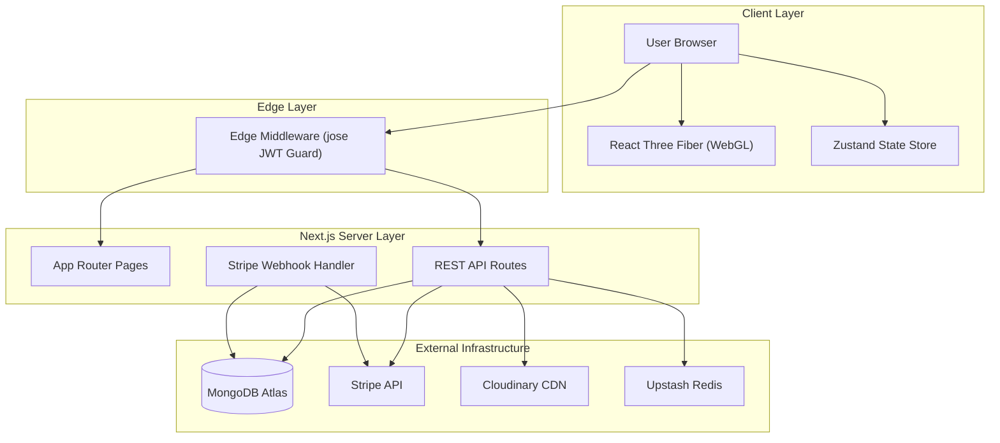

<p align="center">
  <h1 align="center">🪐 Gravity Shop</h1>
  <p align="center">
    <strong>A Production-Grade 3D E-Commerce Platform</strong>
  </p>
  <p align="center">
    Built with Next.js 14, Three.js / React Three Fiber, MongoDB Atlas, and Stripe.
  </p>
</p>

<p align="center">
  <a href="https://nextjs.org/"></a>
  <a href="https://react.dev/"></a>
  <a href="https://www.typescriptlang.org/"></a>
  <a href="https://threejs.org/"></a>
  <a href="https://www.mongodb.com/"></a>
  <a href="https://stripe.com/"></a>
  <a href="https://tailwindcss.com/"></a>
</p>

---

## 📖 Table of Contents

- [Overview](#-overview)
- [Key Features](#-key-features)
  - [Customer Storefront](#customer-storefront)
  - [Admin Dashboard](#admin-dashboard)
  - [Security & Performance](#security--performance)
- [Tech Stack](#-tech-stack)
- [System Architecture](#-system-architecture)
- [Project Structure](#-project-structure)
- [Getting Started](#-getting-started)
  - [Prerequisites](#prerequisites)
  - [Installation](#installation)
  - [Environment Variables](#environment-variables)
  - [Database & Third-Party Setup](#database--third-party-setup)
- [Usage & Scripts](#-usage--scripts)
- [API Reference](#-api-reference)
- [License](#-license)

---

## 🚀 Overview

**Gravity Shop** is a modern, high-performance e-commerce web application that merges interactive WebGL 3D product rendering with an enterprise-grade shopping and admin experience.

Customers can interactively inspect products in real-time 3D environments, search with an instant command palette (`Ctrl+K`), manage their shopping cart with fluid micro-animations, and check out securely via Stripe. Administrators gain access to a powerful analytics dashboard to monitor real-time metrics, manage inventory, track customer orders, update store configuration, and handle user accounts.

---

## ✨ Key Features

### Customer Storefront
- 🎨 **3D Interactive Visualizer**: Dynamic product canvas rendering powered by `@react-three/fiber` and `@react-three/drei`.
- 🔍 **Instant Search Palette**: Command-K style quick search modal for immediate product discovery.
- 🛒 **Animated Cart Drawer**: Slide-out cart with live total calculations and smooth Framer Motion flight animations.
- 💳 **Seamless Checkout**: Integrated server-side Stripe Checkout session creation.
- 👤 **Customer Accounts**: Full authentication with order history and profile management.
- 📱 **Fully Responsive**: Dark glassmorphic design optimized across mobile, tablet, and desktop viewports.

### Admin Dashboard
- 📊 **Real-time Analytics**: Visualized revenue charts, monthly sales trends, and top-selling product metrics powered by Recharts.
- 📦 **Product CRUD & Asset Upload**: Manage product inventory with support for multi-image uploads and 3D `.glb` models via Cloudinary.
- 🗃️ **Inventory Control**: Instant stock adjustments with low-stock alerts.
- 📑 **Order Fulfillments**: Filter, inspect, and update order statuses in real-time.
- 👥 **User Management**: Role assignment (Admin vs User), account activation/deactivation, and search.
- ⚙️ **Store Settings**: Persisted configuration for store details, currency, payment settings, and media assets.

### Security & Performance
- 🔐 **Cryptographic Edge Middleware**: JWT verification powered by `jose` running on Next.js Edge Middleware for protected `/admin` routes.
- 🛡️ **Stripe Webhook Verification**: Cryptographic signature validation ensuring tamper-proof payment processing.
- ⚡ **Rate Limiting**: Sliding-window rate limiting on critical endpoints via Upstash Redis.
- 🔒 **Secure Auth**: Password hashing using `bcryptjs` with salt rounds and HTTP-only cookies.
- 🚀 **Dynamic Imports & Code Splitting**: 3D canvas assets lazy-loaded to ensure blazing-fast initial page loads.

---

## 🛠️ Tech Stack

| Category | Technology | Usage |
|---|---|---|
| **Framework** | Next.js 14 (App Router) | Server Components, Client Components, API Routes, Edge Middleware |
| **Language** | TypeScript 5 | End-to-end static typing |
| **Styling** | Tailwind CSS 3 | Modern dark/glassmorphic utility styling |
| **3D Rendering** | Three.js + R3F + Drei | WebGL product canvases & interactive scenes |
| **Animations** | Framer Motion + GSAP | Page transitions, cart fly animations, micro-interactions |
| **State Management** | Zustand | Persistent client cart & global state |
| **Database** | MongoDB Atlas + Mongoose 9 | Document storage & schema definitions |
| **Payments** | Stripe SDK | Checkout sessions & webhook verification |
| **Media Hosting** | Cloudinary | CDN asset hosting for product images and `.glb` 3D models |
| **Rate Limiting** | Upstash Redis | API rate limiting protection |
| **Auth & Security** | `jose` + `jsonwebtoken` + `bcryptjs` | JWT signing, Edge verification, password hashing |
| **Analytics** | Recharts | Admin dashboard data visualization |

---

## 🏗️ System Architecture



---

## 📂 Project Structure

```
Gravity-Shop/
├── app/
│   ├── (admin)/                  # Protected Admin Route Group
│   │   ├── analytics/            # Revenue & Sales Performance Dashboard
│   │   ├── inventory/            # Inventory & Low-Stock Alerts
│   │   ├── orders/               # Customer Order Fulfillment
│   │   ├── products/             # Product Management (CRUD & Uploads)
│   │   ├── settings/             # System & Store Configuration
│   │   ├── users/                # User Management & Roles
│   │   └── layout.tsx            # Admin Dashboard Sidebar Layout
│   ├── (user)/
│   │   ├── account/              # Customer Profile & Past Orders
│   │   └── layout.tsx
│   ├── api/
│   │   ├── admin/                # Secure Admin API Endpoints
│   │   ├── auth/                 # Login & Registration Handlers
│   │   ├── checkout/             # Stripe Session Endpoint
│   │   ├── health/               # System Health Check
│   │   ├── products/             # Public Product Queries
│   │   ├── search/               # Search Palette Endpoint
│   │   └── webhooks/stripe/      # Webhook Event Fulfillment
│   ├── product/[id]/             # Dynamic 3D Product Detail Page
│   ├── layout.tsx                # Global Root Layout
│   ├── page.tsx                  # Landing Page & Featured Products
│   ├── robots.ts                 # Dynamic SEO Robots Configuration
│   └── sitemap.ts                # Dynamic SEO Sitemap
├── components/
│   ├── admin/                    # Admin Data Grids, Upload Modals, Charts
│   ├── canvas/                   # R3F Canvas Scenes, Lights, Controls
│   ├── cart/                     # Cart Drawer, Item Cards, Cart Summaries
│   ├── product/                  # 3D Product Viewers, Product Cards & Grids
│   └── ui/                       # Navbar, Hero Section, Search Palette, Glass Panels
├── lib/
│   ├── db/connect.ts             # Mongoose Connection Singleton
│   ├── models/                   # Schemas for User, Product, Order, Setting
│   ├── api-error.ts              # Unified API Error Handler
│   ├── cloudinary.ts             # Media Upload Utility
│   ├── logger.ts                 # Server-Side Structured Logging
│   └── rate-limit.ts             # Upstash Redis Sliding-Window Rate Limiter
├── store/
│   └── useAppStore.ts            # Zustand Global Cart & Auth Store
├── middleware.ts                 # Edge Middleware Authentication
└── package.json
```

---

## ⚡ Getting Started

### Prerequisites

Ensure you have the following installed on your local machine:
- **Node.js**: `v18.x` or `v20.x`
- **npm**: `v9.x` or higher
- **Git**

### Installation

1. **Clone the repository:**
   ```bash
   git clone https://github.com/AKASH-KALSARIYA/Gravity-Shop.git
   cd Gravity-Shop
   ```

2. **Install dependencies:**
   ```bash
   npm install --legacy-peer-deps
   ```

---

### Environment Variables

Create a `.env.local` file in the root directory and populate it with your service credentials:

```env
# MongoDB Atlas Connection
MONGODB_URI=mongodb+sandbox_uri_here

# JWT Authentication
JWT_SECRET=your_super_secret_jwt_key_here

# Stripe Payments
NEXT_PUBLIC_STRIPE_PUBLISHABLE_KEY=pk_test_...
STRIPE_SECRET_KEY=sk_test_...
STRIPE_WEBHOOK_SECRET=whsec_...

# Cloudinary Storage
CLOUDINARY_CLOUD_NAME=your_cloud_name
CLOUDINARY_API_KEY=your_api_key
CLOUDINARY_API_SECRET=your_api_secret

# Upstash Redis (Rate Limiting)
UPSTASH_REDIS_REST_URL=https://...upstash.io
UPSTASH_REDIS_REST_TOKEN=your_upstash_token
```

---

### Database & Third-Party Setup

#### 1. MongoDB Atlas
- Create a Cluster on [MongoDB Atlas](https://www.mongodb.com/cloud/atlas).
- Create a Database User and whitelist your IP address.
- Copy your connection string into `MONGODB_URI`.

#### 2. Stripe Setup
- Retrieve your Publishable Key and Secret Key from the [Stripe Dashboard](https://dashboard.stripe.com/apikeys).
- For local webhook testing, use the Stripe CLI:
  ```bash
  stripe listen --forward-to localhost:3000/api/webhooks/stripe
  ```

#### 3. Cloudinary Setup
- Retrieve your Cloud Name, API Key, and Secret from your [Cloudinary Console](https://cloudinary.com/console).
- Uploaded product images will auto-organize into `gravity-shop/images/` and 3D models into `gravity-shop/models/`.

#### 4. Setting Up an Admin Account
To create your first admin account:
1. Register a standard user through the UI at `/admin/login` or via the auth modal.
2. Update the user role directly in MongoDB Atlas or shell:
   ```javascript
   db.users.updateOne(
     { email: "admin@example.com" },
     { $set: { role: "admin" } }
   )
   ```

---

## 🚀 Usage & Scripts

Run the following scripts via `npm`:

```bash
# Start Development Server
npm run dev

# Build Production Bundle
npm run build

# Start Production Server
npm start

# Run Code Linter
npm run lint
```

Open [http://localhost:3000](http://localhost:3000) to view the storefront in your browser.

---

## 📡 API Reference

| Method | Endpoint | Access | Description |
|---|---|---|---|
| `POST` | `/api/auth/register` | Public | Register a new customer account |
| `POST` | `/api/auth/login` | Public | Authenticate and issue HTTP-only JWT |
| `GET` | `/api/products` | Public | Fetch list of active products |
| `GET` | `/api/search` | Public | Full-text product search endpoint |
| `POST` | `/api/checkout` | Customer | Initialize Stripe Checkout Session |
| `POST` | `/api/webhooks/stripe` | Stripe | Webhook for payment fulfillment |
| `GET` | `/api/health` | Public | System status check |
| `GET` | `/api/admin/products` | Admin | Retrieve product inventory |
| `POST` | `/api/admin/products` | Admin | Create product with images/3D models |
| `GET` | `/api/admin/orders` | Admin | Fetch customer orders |
| `PATCH` | `/api/admin/orders` | Admin | Update fulfillment status |
| `GET` | `/api/admin/inventory` | Admin | Fetch stock levels |
| `PATCH` | `/api/admin/inventory` | Admin | Adjust stock quantities |
| `GET` | `/api/admin/users` | Admin | Paginated list of users |
| `PATCH` | `/api/admin/users/[id]`| Admin | Modify user role / status |
| `GET` | `/api/admin/analytics` | Admin | Aggregated sales metrics |
| `POST` | `/api/admin/upload` | Admin | Cloudinary media uploader |

---

## 📜 License

Distributed under the **MIT License**. See `LICENSE` for more information.

---

<p align="center">
  Crafted with ❤️ by <a href="https://github.com/AKASH-KALSARIYA">AKASH KALSARIYA</a>
</p>